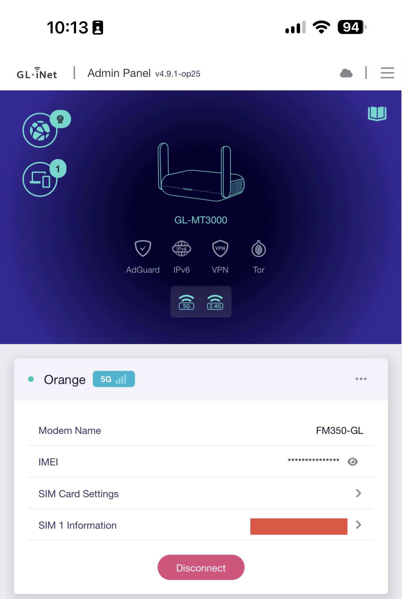
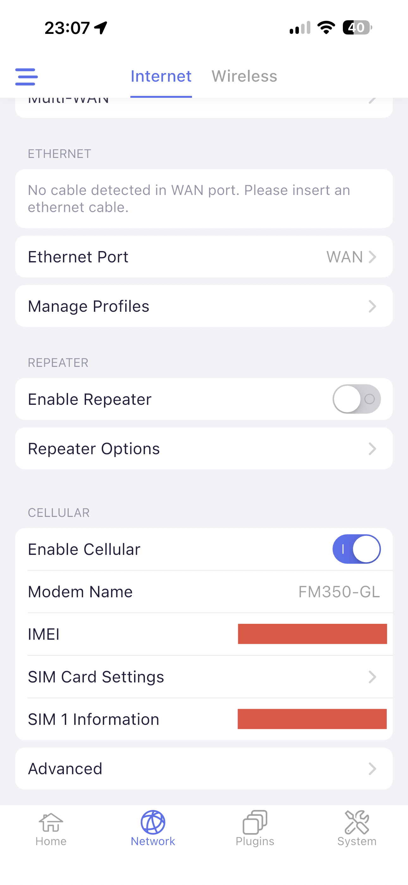

# gl-modem-community

[](https://github.com/rudironsoni/gl-modem-community/releases/latest)
[](https://github.com/rudironsoni/gl-modem-community/actions/workflows/release.yml)
[](https://github.com/rudironsoni/gl-modem-community/actions/workflows/ci.yml)

`gl-modem-community` adds community modem definitions and compatibility drivers to the cellular stack included in GL.iNet firmware. It keeps the stock web UI, mobile app backend, JSON-RPC and ubus interfaces, and built-in modem definitions.

The first driver targets the Fibocom FM350-GL on a GL.iNet GL-MT3000 (Beryl AX). The package depends on GL.iNet's proprietary cellular services and does not replace them, so it is not a modem manager for vanilla OpenWrt.

> [!WARNING]
> This project is still experimental. The FM350-GL is detected and visible in the GL.iNet interfaces, but the complete data-session and recovery test matrix has not passed yet.

## Compatibility status

A package that builds against an SDK has not necessarily been tested on firmware from the same OpenWrt release.

| Firmware scope | Package format | Build status | Hardware status |
| --- | --- | --- | --- |
| GL.iNet OpenWrt 25 on GL-MT3000 | APK | Builds with the pinned OpenWrt 25.12.5 MediaTek Filogic SDK | Partially tested with FM350-GL |
| GL.iNet OEM or OpenWrt 24 on GL-MT3000 | IPK | Builds with the pinned OpenWrt 24.10.7 MediaTek Filogic SDK | Not tested |
| Other GL.iNet routers | Target-specific package required | Not built | Not tested |
| Vanilla OpenWrt | Not applicable | GL.iNet cellular services are absent | Not supported |

The OpenWrt 25 hardware work has verified:

- FM350-GL USB IDs `0e8d:7126` and `0e8d:7127`;
- `ttyUSB` enumeration in the observed RNDIS compositions;
- AT offset `2` for product `7126` and offset `3` for product `7127`;
- SIM detection and ICCID and IMSI reads through the stock common driver;
- modem visibility in the GL.iNet web UI and mobile app.

The following behavior still needs hardware testing:

- PDP activation and a sustained data session;
- interface addressing, routes, and DNS;
- reconnect and recovery after USB re-enumeration;
- the complete web UI and mobile app flows;
- installation and runtime behavior on current GL.iNet OEM and OpenWrt 24 firmware;
- regression testing with a modem already supported by GL.iNet.

See the [hardware validation plan](docs/validation-plan.md) for the full test matrix.

## Hardware evidence

The screenshots below show the FM350-GL in the GL.iNet admin panel and mobile app on the reference GL-MT3000. They prove detection and UI visibility. They do not prove that the modem completed a data session. IMEI and SIM details are redacted.

| GL.iNet admin panel | GL.iNet mobile app |
| --- | --- |
|  |  |

## Install the current FM350 release

Download the package for your firmware and `SHA256SUMS` from the [latest release](https://github.com/rudironsoni/gl-modem-community/releases/latest). Copy both files to `/tmp` on the router and replace `VERSION` below with the release number you downloaded.

Check the package before installing it:

```sh
cd /tmp
sha256sum gl-modem-community*VERSION*
cat SHA256SUMS
```

### APK firmware

GL.iNet firmware that uses APK must trust the project's public key before installing the package. LuCI can manage the feed after this one-time bootstrap, but it cannot import third-party APK signing keys.

```sh
cd /tmp
wget -O gl-modem-community.pem \
  https://github.com/rudironsoni/gl-modem-community/releases/latest/download/gl-modem-community.pem
wget -O gl-modem-community.pem.sha256 \
  https://github.com/rudironsoni/gl-modem-community/releases/latest/download/gl-modem-community.pem.sha256
sha256sum -c gl-modem-community.pem.sha256
cp gl-modem-community.pem /etc/apk/keys/
chmod 0644 /etc/apk/keys/gl-modem-community.pem
```

#### Install from the feed with LuCI

After installing the public key:

1. Open the GL.iNet admin panel, select **Advanced Settings**, and enter LuCI.
2. Go to **System → Software**.
3. Select **Configure apk**.
4. Add this line to `/etc/apk/repositories.d/customfeeds.list`:

   ```text
   https://github.com/rudironsoni/gl-modem-community/releases/latest/download/packages.adb
   ```

5. Save the configuration and select **Update lists…**.
6. Search for `gl-modem-community` and select **Install**.
7. Go to **System → Startup** and confirm that `gl_modem_community` is enabled.

If the configuration button says **Configure opkg**, this firmware cannot use the APK feed. Follow the IPK instructions instead.

To register and install from the APK feed without LuCI:

```sh
feed='https://github.com/rudironsoni/gl-modem-community/releases/latest/download/packages.adb'
mkdir -p /etc/apk/repositories.d
touch /etc/apk/repositories.d/customfeeds.list
grep -Fqx "$feed" /etc/apk/repositories.d/customfeeds.list || \
  printf '%s\n' "$feed" >> /etc/apk/repositories.d/customfeeds.list
apk update
apk add gl-modem-community
```

Installation enables and starts `gl_modem_community`, then restarts the stock cellular manager so the runtime overlays take effect immediately.

The release APK carries the same signature, so a direct local install uses the same trust validation after the key is installed:

```sh
apk add /tmp/gl-modem-community-VERSION-r1.apk
```

### IPK firmware

> [!CAUTION]
> The IPK builds against the OpenWrt 24.10 SDK, but it has not been tested on GL.iNet OEM or OpenWrt 24 firmware.

```sh
opkg install /tmp/gl-modem-community_VERSION-r1_aarch64_cortex-a53.ipk
```

The IPK targets `aarch64_cortex-a53` and still requires GL.iNet's `cellular_manager`, `modem_AT`, model table, and RPC stack.

## Verify the FM350 setup

Confirm that the merged model table and FM350 compatibility wrapper are mounted:

```sh
mount | grep -E '(/usr/bin/modem_AT|/lib/modem_data/modem_list.json)'
jq -e '.modems[] | select(.vid == "0e8d" and (.pid == "7126" or .pid == "7127"))' \
  /lib/modem_data/modem_list.json
```

Attach the modem and inspect the stock service path:

```sh
ubus list -v cellular.sim
ubus list -v cellular.modem
logread | grep -E 'FM350 modem_AT compatibility|modem_AT: Bus:|SIM INSERT|CGDCONT|CGACT|CGPADDR|Dial success'
```

A detected SIM does not prove that the data session works. Confirm that the cellular interface has its own address, route, and DNS configuration. An address on the Wi-Fi repeater interface, usually `wwan` or `sta0`, is unrelated.

## Remove the package

For APK:

```sh
apk del gl-modem-community
```

For IPK:

```sh
opkg remove gl-modem-community
```

Removal stops and disables `gl_modem_community`, restores plugin-owned network values and stock bind-mount targets, and restarts the stock cellular manager. Values changed by the user or stock software after the plugin applied them are preserved.

## How the package extends GL.iNet firmware

| Path | Purpose |
| --- | --- |
| `files/usr/share/gl-modem-community/drivers.d/*.json` | Adds modem definitions to the runtime model table |
| `files/lib/netifd/proto/*.sh` and `files/etc/gcom/*.gcom` | Adds a data protocol when the stock firmware does not provide one |
| `files/usr/share/gl-modem-community/rpc-drivers/*.lua` | Handles selected stock RPC methods for a specific USB ID |
| `files/usr/libexec/gl-modem-community/` | Contains modem-specific compatibility helpers |
| `files/etc/init.d/gl_modem_community` | Builds and mounts the runtime model table before the stock cellular manager starts |

The model merger accepts JSON fragments with a `modems` array and deduplicates entries by `bus_type:vid:pid`. The RPC dispatcher loads a community driver by USB ID. If that driver does not implement a method, the dispatcher calls GL.iNet's stock backend.

The FM350 implementation also uses an AT compatibility wrapper and a network repair helper. Both are limited to the FM350 USB IDs.

See the [package design](docs/package-design.md) for the component contract and rollback behavior.

## Add another modem

1. Capture the modem's USB IDs, USB interfaces, serial driver, AT port, data interface, and stock failure.
2. Add a model fragment under `package/gl-modem-community/files/usr/share/gl-modem-community/drivers.d/`. Use [`fm350.json`](package/gl-modem-community/files/usr/share/gl-modem-community/drivers.d/fm350.json) as a structural reference, but include only fields verified for the new modem.
3. Reuse a stock function map and existing netifd protocol when hardware tests show that they work. Add modem-specific GCOM, protocol, RPC, or compatibility code only for missing behavior.
4. Update `package/gl-modem-community/Makefile` so the package installs every new runtime file.
5. Add focused tests and register them in `tests/run.sh`.
6. Run the offline test suite and build each applicable package format.
7. Test the package on hardware. Include service restart, router reboot, removal, stock-path restoration, and a modem already supported by GL.iNet.

```sh
make tools
make test
make package
make package-opkg
git diff --check
```

A pull request must include the modem name, USB IDs, router model, exact firmware version, package format, test commands, and redacted hardware evidence. Follow the claim rules in [CONTRIBUTING.md](CONTRIBUTING.md).

## Add another GL.iNet router

Supporting another router requires more than adding its name to a table:

1. Confirm that its stock firmware provides compatible `cellular_manager`, `modem_AT`, model table, RPC, and ubus paths.
2. Record the router architecture, exact firmware version, package manager, and SDK source.
3. Add a checksum-pinned package target for the architecture.
4. Run the offline suite and inspect the package contents before installation.
5. Test both a stock-supported modem and a community modem on the router.
6. Confirm that stopping the service restores stock behavior.

List the router as tested only after these checks have run on the device.

## Build and research

Docker is required. The build scripts download checksum-pinned SDKs and keep generated artifacts out of Git.

```sh
make tools
make test
make package
make package-opkg
```

To reproduce the stock firmware analysis:

```sh
make download verify extract inventory analyze report
```

The [modem architecture](docs/modem-architecture.md), [package design](docs/package-design.md), [public source analysis](docs/public-source-analysis.md), and [FM350 gap analysis](docs/fm350-gap-analysis.md) document the evidence and proprietary-code boundary behind the driver.

## Releases

Every pull request runs the offline test suite and builds both package formats. A release adds the signed APK and repository index, the IPK, CycloneDX SBOMs, the public key, checksums, and GitHub build-provenance attestations.

[Release Please](https://github.com/googleapis/release-please) manages versions from Conventional Commits after the release artifacts pass CI and signing.
