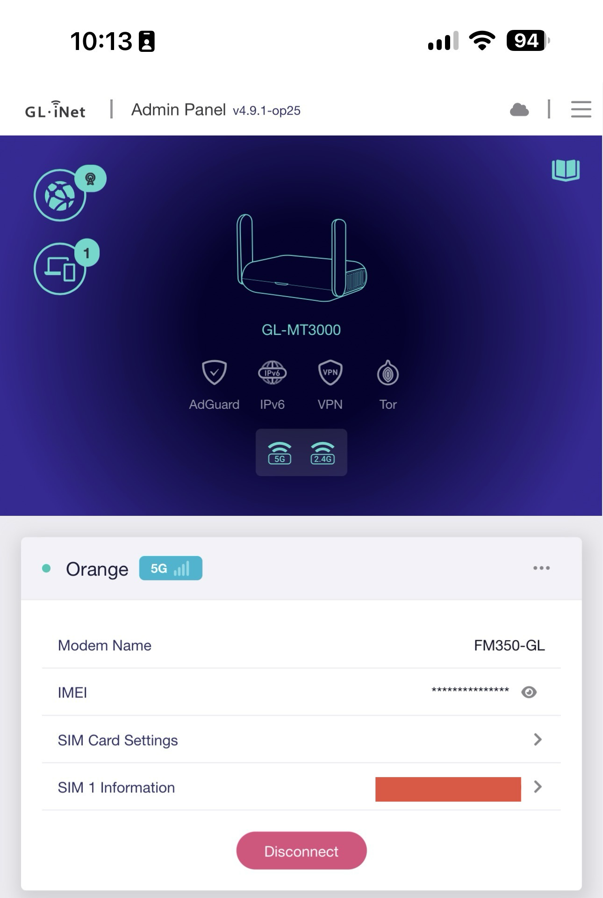
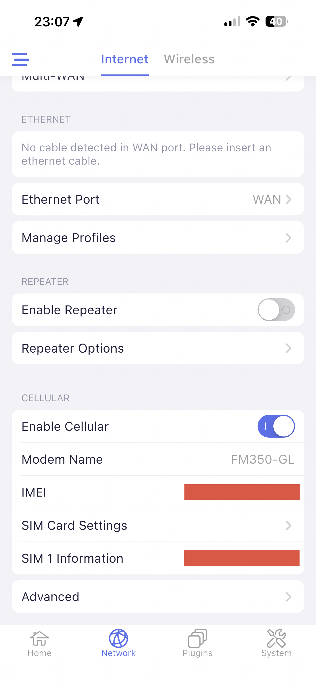

# gl-modem-community

[](https://github.com/rudironsoni/gl-modem-community/releases/latest)
[](https://github.com/rudironsoni/gl-modem-community/actions/workflows/release.yml)
[](https://github.com/rudironsoni/gl-modem-community/actions/workflows/ci.yml)

`gl-modem-community` adds community modem definitions and compatibility drivers to the cellular stack included in GL.iNet firmware. It keeps the stock web UI, mobile app backend, JSON-RPC and ubus interfaces, and built-in modem definitions.

The first driver targets the Fibocom FM350-GL on a GL.iNet GL-MT3000 (Beryl AX). A second, USB-ID-scoped driver integrates the VOS 5G (`05c6:9064`) as a native QMI modem on GL.iNet GL-BE3600 (Slate 7) firmware 4.9.0 release2 build 1036. The package depends on GL.iNet's proprietary cellular services and does not replace them, so it is not a modem manager for vanilla OpenWrt.

> [!WARNING]
> This project is still experimental. Dell DW5931e-eSIM (`0e8d:7127`) physical-SIM and eSIM UI paths are implemented from reporter evidence and firmware analysis; live download of a carrier profile remains `[UNVERIFIED]`. The FM350-GL is detected and visible in the GL.iNet interfaces, but its complete data-session and recovery matrix has not passed. The VOS 5G data session is verified only on the exact GL-BE3600 4.9.0 combination documented below; stock-supported-modem and FM350 regressions on that router remain incomplete.

## Quick start

1. Confirm your firmware and package manager:

   ```sh
   cat /etc/openwrt_release
   command -v apk && echo 'apk firmware'
   command -v opkg && echo 'opkg firmware'
   ```

2. Pick the matching feed:

   - GL.iNet OpenWrt 25 (APK): `https://github.rudironsoni.com/gl-modem-community/feed/25.12`
   - OpenWrt 24 (IPK): `https://github.rudironsoni.com/gl-modem-community/feed/24.10`
   - GL.iNet GL-MT3000 stable/beta 4.8.x/4.9.x (IPK): `https://github.rudironsoni.com/gl-modem-community/feed/21.02`
   - GL.iNet GL-BE3600 4.9.x (IPK): `https://github.rudironsoni.com/gl-modem-community/feed/23.05-be3600`

3. Follow the install path in [Install the current release](#install-the-current-release).
4. Run the checks in [Verify the FM350 setup](#verify-the-fm350-setup) before relying on production traffic.

## Compatibility status

A package that builds against an SDK has not necessarily been tested on firmware from the same OpenWrt release.

| Firmware scope | Package format | Build status | Hardware status |
| --- | --- | --- | --- |
| GL.iNet OpenWrt 25 on GL-MT3000 | APK | Builds with the pinned OpenWrt 25.12.5 MediaTek Filogic SDK | Partially tested with FM350-GL |
| GL.iNet OEM or OpenWrt 24 on GL-MT3000 | IPK | Builds with the pinned OpenWrt 24.10.7 MediaTek Filogic SDK | Not tested |
| GL.iNet 4.9.0 release2 build 1036 on GL-BE3600 | IPK | Dedicated target uses the pinned OpenWrt 23.05.5 IPQ807x userspace ABI surrogate | VOS 5G data session verified; stock-supported modem and FM350-GL not tested |
| Other GL.iNet routers | Target-specific package required | Not built | Not tested |
| Vanilla OpenWrt | Not applicable | GL.iNet cellular services are absent | Not supported |

Dell DW5931e-eSIM (`0e8d:7127`) on GL-MT3000 4.8.1 uses USB interface 6 as the AT port (`/dev/ttyUSB4`). Interface 5 is ADB and is skipped. The kernel hotplug `PRODUCT` value may be `e8d/7127/1` (no leading zero). FCC lock is cleared with `AT+GTFCCLOCKMODE=0` plus a USB power cycle when `AT+GTFCCEFFSTATUS?` reports `2,0`.

On 4.8.1 the package adds **APPLICATIONS → eSIM Management**, a clean-room page that matches the 4.9.x drawer layout and talks to `POST /sdk/v1`. On 4.9.x the stock INTERNET → Cellular eSIM Management drawer uses the same `/sdk/v1` backend. Profile download needs `lpac` on the router.

The OpenWrt 25 hardware work has verified:

- FM350-GL USB IDs `0e8d:7126` and `0e8d:7127`;
- `ttyUSB` enumeration in the observed RNDIS compositions;
- AT offset `2` for product `7126` and offset `3` for product `7127`;
- SIM detection and ICCID and IMSI reads through the stock common driver;
- modem visibility in the GL.iNet web UI and mobile app.

The following behavior still needs hardware testing:

- PDP activation and a sustained data session;
- interface addressing, routes, and DNS;
- reconnect and recovery after USB re-enumeration;
- the complete web UI and mobile app flows;
- installation and runtime behavior on current GL.iNet OEM and OpenWrt 24 firmware;
- regression testing with a modem already supported by GL.iNet.

See the [hardware validation plan](docs/validation-plan.md) for the full test matrix.

The GL-BE3600 hardware run verified VOS 5G USB ID `05c6:9064`, QMI control
through `/dev/cdc-wdm0`, `qmi_wwan`/`wwan0`, stock Cellular UI ownership,
working IPv4 traffic, reboot and USB reattachment recovery, and the explicit
DSD/NAS display value `SA n71`. See the
[GL-BE3600 and VOS 5G evidence](docs/gl-be3600-vos5g.md) for the exact scope
and remaining cases.

## Hardware evidence

The screenshots below show the FM350-GL in the GL.iNet admin panel and mobile app on the reference GL-MT3000. They prove detection and UI visibility. They do not prove that the modem completed a data session. IMEI and SIM details are redacted.

| GL.iNet admin panel | GL.iNet mobile app |
| --- | --- |
|  |  |

## Install the current release

Your firmware uses one of four feeds. Determine which one applies first:

```sh
cat /etc/openwrt_release
command -v apk && echo 'apk firmware'
command -v opkg && echo 'opkg firmware'
```

| Firmware | Destination feed | Package |
| --- | --- | --- |
| GL.iNet OpenWrt 25 | [`https://github.rudironsoni.com/gl-modem-community/feed/25.12`](https://github.rudironsoni.com/gl-modem-community/feed/25.12) | APK |
| OpenWrt 24 | [`https://github.rudironsoni.com/gl-modem-community/feed/24.10`](https://github.rudironsoni.com/gl-modem-community/feed/24.10) | IPK |
| GL-MT3000 4.8.1 stable and 4.9.x beta | [`https://github.rudironsoni.com/gl-modem-community/feed/21.02`](https://github.rudironsoni.com/gl-modem-community/feed/21.02) | IPK |
| GL-BE3600 4.9.x | [`https://github.rudironsoni.com/gl-modem-community/feed/23.05-be3600`](https://github.rudironsoni.com/gl-modem-community/feed/23.05-be3600) | IPK |

All installs require GL.iNet's proprietary cellular services. Check the [compatibility status](#compatibility-status) before installing on hardware that is not yet marked tested.

> [!NOTE]
> The feeds are static files served by GitHub Pages. `opkg update` and `apk update` fetch them with plain HTTP clients that cannot answer JavaScript challenges. If the feed domain sits behind a CDN with bot protection (for example Cloudflare), requests to `/gl-modem-community/feed/*` must be exempted from managed challenges, or feed downloads fail on the router even though the same URLs open in a browser.

### GL.iNet OpenWrt 25 (APK)

If the software page shows **Configure apk**, use this section. GL.iNet firmware that uses APK must trust the project's public key before installing the package. LuCI can manage the feed after this one-time bootstrap, but it cannot import third-party APK signing keys.

```sh
cd /tmp
wget -O gl-modem-community.pem \
  https://github.com/rudironsoni/gl-modem-community/releases/latest/download/gl-modem-community.pem
wget -O gl-modem-community.pem.sha256 \
  https://github.com/rudironsoni/gl-modem-community/releases/latest/download/gl-modem-community.pem.sha256
sha256sum -c gl-modem-community.pem.sha256
cp gl-modem-community.pem /etc/apk/keys/
chmod 0644 /etc/apk/keys/gl-modem-community.pem
```

#### Option A (recommended): Install the APK feed with LuCI

1. Open the GL.iNet admin panel, select **Advanced Settings**, and enter LuCI.
2. Go to **System → Software**.
3. Select **Configure apk**.
4. Add this line to `/etc/apk/repositories.d/customfeeds.list`. `apk` reads a repository line as the index URL itself, so it must end in `packages.adb`:

   ```text
   https://github.rudironsoni.com/gl-modem-community/feed/25.12/packages.adb
   ```

5. Save the configuration and select **Update lists**.
6. Search for `gl-modem-community` and select **Install**.
7. Go to **System → Startup**, enable and restart `gl_modem_community`, and restart `gl_cellular_manager`.

If the software button says **Configure opkg**, use the IPK instructions below instead.

#### Option B: Install the APK feed without LuCI

```sh
feed='https://github.rudironsoni.com/gl-modem-community/feed/25.12/packages.adb'
mkdir -p /etc/apk/repositories.d
touch /etc/apk/repositories.d/customfeeds.list
grep -Fqx "$feed" /etc/apk/repositories.d/customfeeds.list || \
  printf '%s\n' "$feed" >> /etc/apk/repositories.d/customfeeds.list
apk update
apk add gl-modem-community
/etc/init.d/gl_modem_community enable
/etc/init.d/gl_modem_community restart
/etc/init.d/gl_cellular_manager restart
```

#### Option C: Install the APK manually

Download the latest APK and `SHA256SUMS` to `/tmp`, verify the hash line for the APK, then install. Replace `VERSION` with the tag from the release (for example `0.2.11`):

```sh
cd /tmp
wget -O gl-modem-community-${VERSION}-r1.apk \
  https://github.com/rudironsoni/gl-modem-community/releases/download/v${VERSION}/gl-modem-community-${VERSION}-r1.apk
wget -O SHA256SUMS \
  https://github.com/rudironsoni/gl-modem-community/releases/latest/download/SHA256SUMS
grep "gl-modem-community-${VERSION}-r1.apk" SHA256SUMS | sha256sum -c
apk add /tmp/gl-modem-community-${VERSION}-r1.apk
/etc/init.d/gl_modem_community enable
/etc/init.d/gl_modem_community restart
/etc/init.d/gl_cellular_manager restart
```

### OpenWrt 24 (IPK)

#### Option A (recommended): Install from the OpenWrt 24 feed

Add the OpenWrt 24 feed to `/etc/opkg/customfeeds.conf`. Create the file first if it does not exist:

```sh
touch /etc/opkg/customfeeds.conf
chmod 0644 /etc/opkg/customfeeds.conf
echo 'src/gz gl-modem-community https://github.rudironsoni.com/gl-modem-community/feed/24.10' \
  >> /etc/opkg/customfeeds.conf
opkg update
opkg install gl-modem-community
/etc/init.d/gl_modem_community enable
/etc/init.d/gl_modem_community restart
/etc/init.d/gl_cellular_manager restart
```

After a new release:

```sh
opkg update
opkg upgrade gl-modem-community
```

#### Option B: Install one IPK manually

Install a single IPK manually with `VERSION` set to the release tag:

```sh
cd /tmp
wget -O gl-modem-community_${VERSION}-r1_aarch64_cortex-a53.ipk \
  https://github.com/rudironsoni/gl-modem-community/releases/download/v${VERSION}/gl-modem-community_${VERSION}-r1_aarch64_cortex-a53.ipk
wget -O SHA256SUMS \
  https://github.com/rudironsoni/gl-modem-community/releases/latest/download/SHA256SUMS
grep "gl-modem-community_${VERSION}-r1_aarch64_cortex-a53.ipk" SHA256SUMS | sha256sum -c
opkg install /tmp/gl-modem-community_${VERSION}-r1_aarch64_cortex-a53.ipk
/etc/init.d/gl_modem_community enable
/etc/init.d/gl_modem_community restart
/etc/init.d/gl_cellular_manager restart
```

### GL.iNet GL-BE3600 4.9.x (IPK)

The Slate 7 reports package architecture
`aarch64_cortex-a53_neon-vfpv4`; do not install the GL-MT3000 IPK on it.

#### Option A (recommended): Install from the GL-BE3600 feed

```sh
touch /etc/opkg/customfeeds.conf
chmod 0644 /etc/opkg/customfeeds.conf
echo 'src/gz gl-modem-community https://github.rudironsoni.com/gl-modem-community/feed/23.05-be3600' \
  >> /etc/opkg/customfeeds.conf
opkg update
opkg install gl-modem-community
/etc/init.d/gl_modem_community enable
/etc/init.d/gl_modem_community restart
```

#### Option B: Install one IPK manually

```sh
cd /tmp
wget -O gl-modem-community_${VERSION}-r1_gl-be3600-4.9_aarch64_cortex-a53_neon-vfpv4.ipk \
  https://github.com/rudironsoni/gl-modem-community/releases/download/v${VERSION}/gl-modem-community_${VERSION}-r1_gl-be3600-4.9_aarch64_cortex-a53_neon-vfpv4.ipk
wget -O SHA256SUMS \
  https://github.com/rudironsoni/gl-modem-community/releases/latest/download/SHA256SUMS
grep "gl-modem-community_${VERSION}-r1_gl-be3600-4.9_aarch64_cortex-a53_neon-vfpv4.ipk" SHA256SUMS | sha256sum -c
opkg install /tmp/gl-modem-community_${VERSION}-r1_gl-be3600-4.9_aarch64_cortex-a53_neon-vfpv4.ipk
/etc/init.d/gl_modem_community enable
/etc/init.d/gl_modem_community restart
```

### GL.iNet current stable and beta (IPK 21.02)

#### Option A (recommended): Install from the GL.iNet 21.02 feed

Current GL-MT3000 OEM firmware (stable 4.8.x and beta 4.9.x) runs OpenWrt 21.02 with `opkg`. Use the feed for the 21.02 build. GL-BE3600 uses the dedicated feed above instead.

```sh
touch /etc/opkg/customfeeds.conf
chmod 0644 /etc/opkg/customfeeds.conf
echo 'src/gz gl-modem-community https://github.rudironsoni.com/gl-modem-community/feed/21.02' \
  >> /etc/opkg/customfeeds.conf
opkg update
opkg install gl-modem-community
/etc/init.d/gl_modem_community enable
/etc/init.d/gl_modem_community restart
```

A new release upgrade is the same as the OpenWrt 24 case: `opkg update` then `opkg upgrade gl-modem-community`.

#### Option B: Install one IPK manually

Install a single IPK manually with `VERSION` set to the release tag:

```sh
cd /tmp
wget -O gl-modem-community_${VERSION}-1_glinet-21.02_aarch64_cortex-a53.ipk \
  https://github.com/rudironsoni/gl-modem-community/releases/download/v${VERSION}/gl-modem-community_${VERSION}-1_glinet-21.02_aarch64_cortex-a53.ipk
wget -O SHA256SUMS \
  https://github.com/rudironsoni/gl-modem-community/releases/latest/download/SHA256SUMS
grep "gl-modem-community_${VERSION}-1_glinet-21.02_aarch64_cortex-a53.ipk" SHA256SUMS | sha256sum -c
opkg install /tmp/gl-modem-community_${VERSION}-1_glinet-21.02_aarch64_cortex-a53.ipk
/etc/init.d/gl_modem_community enable
/etc/init.d/gl_modem_community restart
```

On 4.8.x (legacy `modem` stack) and 4.9.x (`gl_cellular_manager`), the package hooks restart the respective stack automatically. The 21.02 IPK is the userspace-only build from `feeds/21.02/`; it still requires the stock `cellular_manager`, `modem_AT`, model table, and RPC stack.

## Verify the FM350 setup

Confirm that the merged model table and FM350 compatibility wrapper are mounted:

```sh
mount | grep -E '(/usr/bin/modem_AT|/lib/modem_data/modem_list.json)'
jq -e '.modems[] | select(.vid == "0e8d" and (.pid == "7126" or .pid == "7127"))' \
  /lib/modem_data/modem_list.json
```

Attach the modem and inspect the stock service path:

```sh
ubus list -v cellular.sim
ubus list -v cellular.modem
logread | grep -E 'FM350 modem_AT compatibility|modem_AT: Bus:|SIM INSERT|CGDCONT|CGACT|CGPADDR|Dial success'
```

A detected SIM does not prove that the data session works. Confirm that the cellular interface has its own address, route, and DNS configuration. An address on the Wi-Fi repeater interface, usually `wwan` or `sta0`, is unrelated.

## Remove the package

For APK:

```sh
/etc/init.d/gl_modem_community stop
apk del gl-modem-community
/etc/init.d/gl_cellular_manager restart
```

For IPK:

```sh
/etc/init.d/gl_modem_community stop
opkg remove gl-modem-community
sed -i '/gl-modem-community/d' /etc/opkg/customfeeds.conf 2>/dev/null || true
/etc/init.d/gl_cellular_manager restart
```

Stopping or removing the package unmounts its runtime overlays and restores the original stock paths.

## How the package extends GL.iNet firmware

| Path | Purpose |
| --- | --- |
| `files/usr/share/gl-modem-community/drivers.d/*.json` | Adds modem definitions to the runtime model table |
| `files/lib/netifd/proto/*.sh` and `files/etc/gcom/*.gcom` | Adds a data protocol when the stock firmware does not provide one |
| `files/usr/share/gl-modem-community/rpc-drivers/*.lua` | Handles selected stock RPC methods for a specific USB ID |
| `files/usr/libexec/gl-modem-community/` | Contains modem-specific compatibility helpers |
| `files/etc/init.d/gl_modem_community` | Builds and mounts the runtime model table before the stock cellular manager starts |

The model merger accepts JSON fragments with a `modems` array and deduplicates entries by `bus_type:vid:pid`. The RPC dispatcher loads a community driver by USB ID. If that driver does not implement a method, the dispatcher calls GL.iNet's stock backend.

The FM350 implementation also uses an AT compatibility wrapper and a network repair helper. Both are limited to the FM350 USB IDs.

See the [package design](docs/package-design.md) for the component contract and rollback behavior.

## Add another modem

1. Capture the modem's USB IDs, USB interfaces, serial driver, AT port, data interface, and stock failure.
2. Add a model fragment under `package/gl-modem-community/files/usr/share/gl-modem-community/drivers.d/`. Use [`fm350.json`](package/gl-modem-community/files/usr/share/gl-modem-community/drivers.d/fm350.json) as a structural reference, but include only fields verified for the new modem.
3. Reuse a stock function map and existing netifd protocol when hardware tests show that they work. Add modem-specific GCOM, protocol, RPC, or compatibility code only for missing behavior.
4. Update `package/gl-modem-community/Makefile` so the package installs every new runtime file.
5. Add focused tests and register them in `tests/run.sh`.
6. Run the offline test suite and build each applicable package format.
7. Test the package on hardware. Include service restart, router reboot, removal, stock-path restoration, and a modem already supported by GL.iNet.

```sh
make tools
make test
make package
make package-opkg
make package-be3600
git diff --check
```

A pull request must include the modem name, USB IDs, router model, exact firmware version, package format, test commands, and redacted hardware evidence. Follow the claim rules in [CONTRIBUTING.md](CONTRIBUTING.md).

## Add another GL.iNet router

Supporting another router requires more than adding its name to a table:

1. Confirm that its stock firmware provides compatible `cellular_manager`, `modem_AT`, model table, RPC, and ubus paths.
2. Record the router architecture, exact firmware version, package manager, and SDK source.
3. Add a checksum-pinned package target for the architecture.
4. Run the offline suite and inspect the package contents before installation.
5. Test both a stock-supported modem and a community modem on the router.
6. Confirm that stopping the service restores stock behavior.

List the router as tested only after these checks have run on the device.

## Build and research

Docker is required. The build scripts download checksum-pinned SDKs and keep generated artifacts out of Git.

```sh
make tools
make test
make package
make package-opkg
make package-be3600
```

To reproduce the stock firmware analysis:

```sh
make download verify extract inventory analyze report
```

The [modem architecture](docs/modem-architecture.md), [package design](docs/package-design.md), [public source analysis](docs/public-source-analysis.md), and [FM350 gap analysis](docs/fm350-gap-analysis.md) document the evidence and proprietary-code boundary behind the driver.

## Releases

Every pull request runs the offline test suite and all package targets. A release adds the signed APK and repository index, target-specific IPKs, CycloneDX SBOMs, the public key, checksums, and GitHub build-provenance attestations.

[Release Please](https://github.com/googleapis/release-please) derives versions from Conventional Commits and maintains one release pull request. The workflow builds and signs the proposed packages, commits the generated `feed/` files to that pull request, and reruns its required CI. Merging the release pull request updates the GitHub Pages feed on `main` and publishes the matching GitHub Release from those exact committed packages.
