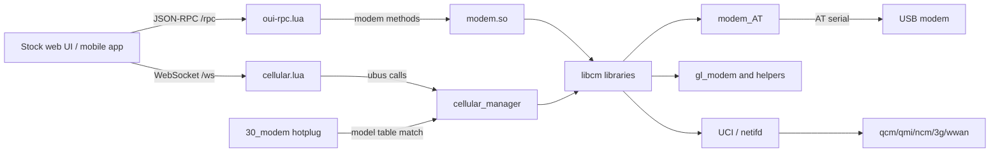

# Stock modem architecture

Conclusion: [CONFIRMED] `/etc/init.d/gl_cellular_manager` starts resident `/usr/bin/cellular_manager` at procd priority 23. It owns the `cellular.status`, `cellular.modem`, `cellular.sim`, and `cellular.network` ubus objects.

Evidence: init script, binary strings, websocket calls, and ELF dependency metadata.

Confidence: high. Registration names are confirmed statically; live method schemas require `ubus list -v`.

Alternative explanations: some object methods may be delegated internally to `libcm` or another process.

How to verify dynamically: capture `ubus list -v`, `ps w`, and `ubus monitor` before attaching a modem.

Conclusion: [CONFIRMED] `/usr/lib/oui-httpd/rpc/modem.so` links directly to `libcm_modem`, `libcm_sim`, and `libcm_network`. `/usr/bin/gl_modem` is one client/helper and is not the complete backend.

Evidence: `analysis/elf/` readelf reports and call-site strings.

Confidence: confirmed.

Alternative explanations: none for direct ELF dependencies. Runtime paths may skip some libraries for individual requests.

How to verify dynamically: trace process execution and shared-library/file operations while invoking each frontend method.

Conclusion: [CONFIRMED] `/usr/lib/oui-httpd/rpc/modem` is checked before `modem.so`; methods absent from the Lua module fall through to the stock `.so` through `/cgi-bin/glc`.

Evidence: `/usr/share/gl-ngx/oui-rpc.lua` static control flow.

Confidence: high.

Alternative explanations: exact error propagation depends on the deployed GL nginx Lua runtime.

How to verify dynamically: install the reversible package, call one proxied and one fallback method, and compare JSON-RPC envelopes byte-for-byte.

State and IPC identified statically include UCI, `/tmp/<bus>.sock`, per-device `/var/lock/cellular_<bus>.lock`, ubus, procd, netifd, hotplug environment variables, and temporary status files referenced in the string catalog.
